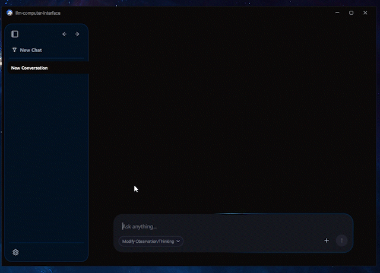
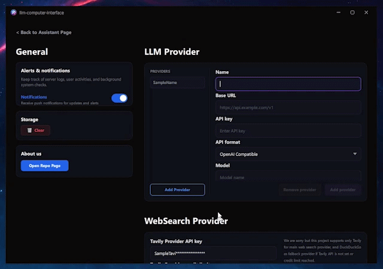
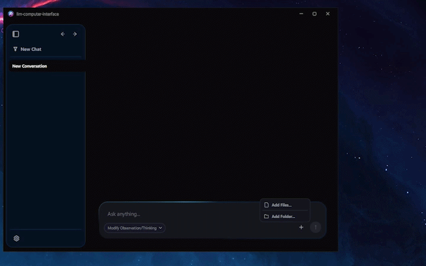
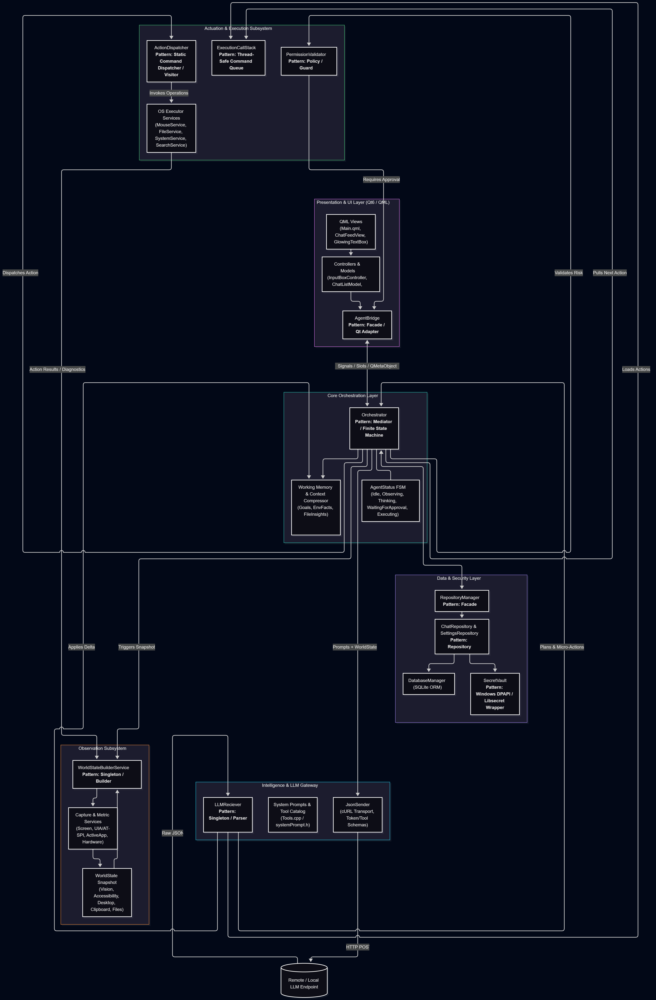

# llm-computer-interface

A cross-platform runtime for connecting LLMs to desktop environments through observation, context gathering, action execution, and verification.
## Introduction

**llm-computer-interface** is a native, high-performance desktop runtime and companion designed for seamless daily computer assistance. Built from scratch in modern C++20 and Qt 6/QML, it bridges any OpenAI-compatible multimodal model directly to your operating system. Rather than relying on slow screen scrapers or brittle automation scripts, it provides an ultra-responsive desktop copilot that perceives your workflow, plans multi-step tasks, and safely interacts with native applications.
#### Why a Native Desktop Runtime?
Most emerging computer-use agents are designed as headless Python CLI scripts. While adequate for cloud benchmarks or server automation, they fall short as practical, day-to-day desktop companions:
* **Perception Latency & High Overhead:** Heavy interpreted scripts and unoptimized capture pipelines create noticeable lag, making real-time interaction sluggish and resource-heavy on your workstation.
* **Pixel-Only Blindness:** Looking strictly at raw screenshots leaves the agent blind to vital context—such as active window state, clipboard contents, accessibility hierarchies, and background system load.
* **Clunky User Experience:** Daily computer assistance requires a fluid, intuitive interface—not terminal logs and detached console prompts.
* **Unsafe OS Execution:** Giving an agent unchecked control over shell commands and input devices without call tracking or explicit user authorization introduces major security and usability hazards.
**llm-computer-interface** solves this by treating the desktop as an integrated ecosystem. It pairs sub-millisecond OS perception with a reactive, user-centric GUI and rigid action safeguards.
### How It Differs

| Dimension               | Typical Python Computer-Use Agent    | llm-computer-interface                                                                         |
| :---------------------- | :----------------------------------- | :--------------------------------------------------------------------------------------------- |
| **Core Architecture**   | Interpreted Python runtime           | **Native C++20 & CMake** for minimal latency and memory footprint                              |
| **User Experience**     | Terminal / Headless CLI              | **Fluid Qt 6 & QML GUI** with real-time plan cards, status streaming, and chat feeds           |
| **Model Compatibility** | Locked to specific proprietary SDKs  | **Universal OpenAI-Compatible Gateway** (OpenAI, OpenRouter, vLLM, Ollama, DeepSeek)           |
| **Perception Model**    | Vision-only (screenshots)            | **Multi-Modal `WorldState`**: Screen captures + Accessibility trees + Clipboard + App tracking |
| **Actuation & Safety**  | Blind script execution via PyAutoGUI | **`PermissionValidator` & `ExecutionCallStack`** with step confirmation stages                 |
| **Credential Security** | Plaintext `.env` configs             | **`SecretVault`** for encrypted API key and token storage                                      |
| **Persistence**         | Ephemeral or scattered JSON logs     | **Embedded SQLite Engine** for long-term chat history, session state, and settings             |
| **Target Platforms**    | Generic OS workarounds               | **Native Win32 & Linux (X11)** platform APIs for precision input and window tracking           |

## Demo

## Key Features
* **Comprehensive Desktop Perception (`WorldState`)**: Combines visual screen captures with accessibility trees, active window telemetry, clipboard data, and local file contexts.
* **Native OS Actuation**: Delivers low-latency mouse and keyboard control via native Win32 and Linux X11 APIs, alongside asynchronous shell and file operations.
* **Safety & Credential Security**: Enforces explicit permission checks on critical system tasks through `PermissionValidator` and safeguards API keys inside an encrypted `SecretVault`.
* **Modern Qt 6 Interface**: A lightweight, GPU-accelerated QML desktop interface with real-time status tracking and native markdown chat feeds.
* **Universal Gateway & Local Storage**: Plugs into any OpenAI-compatible model provider and saves sessions locally using an embedded SQLite database.
* **Integrated Web Search:** Built-in web research capability via a local DuckDuckGo sidecar provider for real-time external knowledge retrieval.

## Documentation
#### [Read Our Documentation](docs/DOC.md)
#### Architecture UML Diagram

#### Sequential UML Diagram

## Installation & Setup

## Authors

* **Ali Pourkarim** — *Project Lead & System Architect & Core Developer*
    * Overall system architecture and design
    * Core runtime & orchestrator implementation
    * Observation engine, actuation pipeline, and LLM gateway integration
    * Frontend

* **AmirReza Seyed Nasiri** — *Core Developer & System Architect*
    * Overall system architecture and design
    * LLM Gateway communication
    * Actuation services and OS input dispatchers
    * Observation telemetry and screen capture pipelines

* **Mohammad Mahdi HajiMobini** — *Core Developer*
    * Database design and SQLite repository management
    * Frontend
    * Actuation execution services and system debugging

* **Amir Arsalan Gandomi** - *UI/UX Designer*
    * UI and UX design